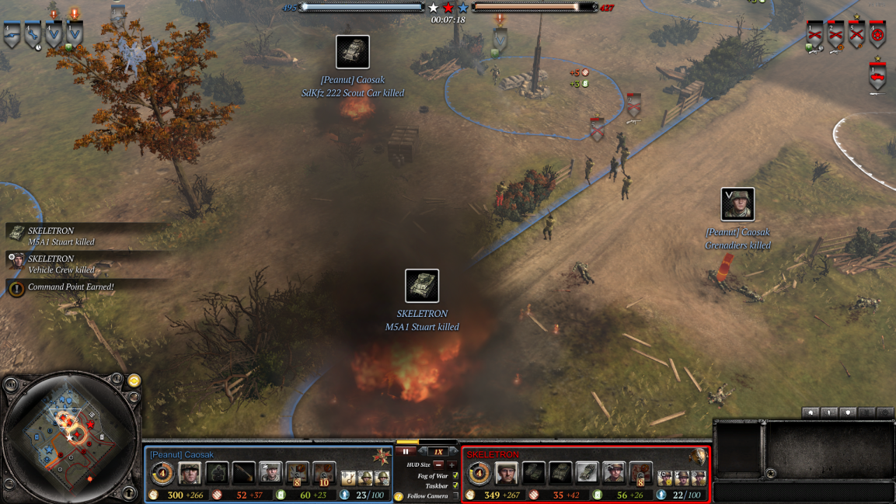

# Features

- All events of an entire squad dying are indicated with in-game UI elements
    - Death events appear in the event queue and clicking the event moves the camera to the event location
    - Death event indicators are displayed for 60 seconds 
        - Indicator consists of a minimap/tactical map icon (red ☠️) and an in-game marker with player name, unit icon, and unit name
    - Any death event indicator can be removed by pressing `Ctrl+D` (likely not the final hotkey, can be easily changed)
        - Selection of which death event indicator is removed is based on distance to the current camera position
        - Selection may be based on mouse position instead in the future to allow more accurate control

# Usage
1. Download `replay-enhancements.zip` of the [latest release](https://github.com/Janne252/coh2-replay-enhancements/releases) and extract its contents to CoH2's install directory, creating the directory path `<..>\steamapps\common\Company of Heroes 2\replay-enhancements\`
    - This directory should contain all the `.scar` files
1. Download [wipes.rec](https://github.com/Janne252/coh2-replay-enhancements/raw/master/examples/wipes.rec) replay file to `\Documents\My Games\Company of Heroes 2\playback`
    - This is a short replay file intended for testing and should be used on the first time and after updates
    - The replay requires the [CheatCommands Mod II](https://steamcommunity.com/sharedfiles/filedetails/?id=692412438) mod to be installed
1. Add `-dev` to CoH2's launch options
1. Load up a replay
1. Pause the game
1. Open the in-game console by pressing `Ctrl+Shift+~` or `Ctrl+Shift+Ö` depending on your keyboard layout
1. Paste in `dofile("replay-enhancements\\init.scar")` and press enter
1. Close the in-game console (same hotkey as the one used to open the in-game console)
1. Unpause the game

# Known issues
_None at the moment_

# Troubleshooting
- `Fatal Scar Error - Execution Paused` message during replay playback
    - Try unpausing the game to continue
    - Open a new [issue](https://github.com/Janne252/coh2-replay-enhancements/issues) and attach/include:
        - Version number (displayed in the console after initializing the tool)
        - The replay (`.rec`) file
        - Screenshot/timestamp of the error

# Configuration
The following options can be changed by editing `config.scar` with a text editor:

| Option                            | Description                                                                 | Default value  |
|-----------------------------------|-----------------------------------------------------------------------------|----------------|
| `event_indicator_display_seconds` | Event (death, abandon, etc.) indicator display time in seconds.             | `60`           |

# License
- See [LICENSE.txt](LICENSE.txt)
