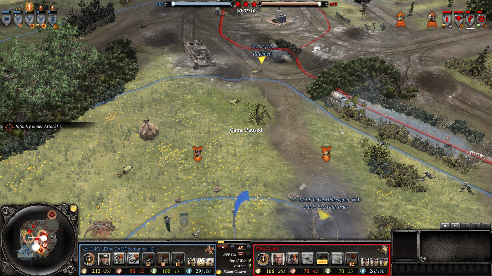

# Features

- All events of an entire squad dying are indicated with in-game UI elements
    - Death events appear in the event queue andand clicking the event moves the camera to the event location
    - Death event indicators are displayed for 60 seconds 
        - Indicator consists of a minimap/tactical map icon (red ☠️) and an in-game marker with player name, unit icon, and unit name
    - Any death event indicator can be removed by pressing `Ctrl+D` (likely not the final hotkey, can be easily changed)
        - Selection of which death event indicator is removed is based on distance to the current camera position
        - Selection may be based on mouse position instead in the future to allow more accurate control

# Usage
1. Download `replay-enhancements.zip` of the [latest release](https://github.com/Janne252/coh2-replay-enhancements/releases) and extract its contents to CoH2's install directory, creating the directory path `<..>\steamapps\common\Company of Heroes 2\replay-enhancements\`
    - This directory should contain all the `.scar` files
1. Download [wipes.rec](https://github.com/Janne252/coh2-replay-enhancements/raw/master/examples/wipes.rec) replay file to `\Documents\My Games\Company of Heroes 2\playback`
    - This is a short replay file intended for testing and should be used on the first time and after updates
    - The replay requires the [CheatCommands Mod II](https://steamcommunity.com/sharedfiles/filedetails/?id=692412438) mod to be installed
1. Add `-dev` to CoH2's launch options
1. Load up a replay
1. Pause the game
1. Open the in-game console by pressing `Ctrl+Shift+~` or `Ctrl+Shift+Ö` depending on your keyboard layout
1. Paste in `dofile("replay-enhancements\\init.scar")` and press enter
1. Close the in-game console (same hotkey as the one used to open the in-game console)
1. Unpause the game

# Planned features
- [x] Detect team weapon abandons and indicate as _decrewed_ instead of _killed_
- [x] Ignore retreating abandoned team weapon team member deaths
- [x] (Experimental) Use the threat arrow system to display arrows towards death event locations
- [x] Ignore aircraft deaths

# Primary test replay 
- [x] Infantry squad deaths
- [x] HMG team weapon death
- [x] AT gun team weapon death and retreating team weapon member death
- [x] Vehicle death
- [x] Vehicle abandon 
- [x] Aircraft death

# License
- See [LICENSE.txt](LICENSE.txt)
